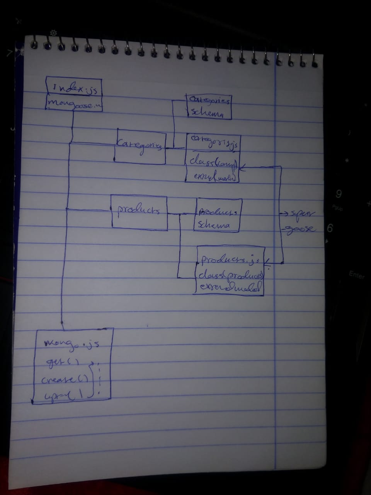

# LAB - Class 05

## Data Modeling With NoSQL Databases

### Author: Ibrahim

### Links and Resources

* [submission PR](https://github.com/401-advanced-javascript-ibrahim/data-modeling-with-noSQL-databases/pull/1)
* [ci/cd](https://github.com/401-advanced-javascript-ibrahim/data-modeling-with-noSQL-databases/actions) (GitHub Actions)

### Setup

#### How to initialize/run your application (where applicable)

- `npm run start` 

#### Tests

* How do you run tests?
* `npm run test` 

#### UML

